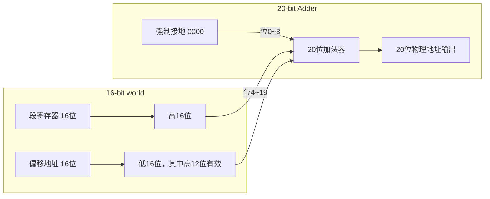

# day03-rozi00c

## 8086 实模式分段寻址深度解析

### 1. 为什么我们需要“分段”？

8086 是 **16 位 CPU**，寄存器最大宽度 16 位。  
16 位能表示的最大地址是 `2^16 = 65536`，也就是 **64KB**。  
但是 IBM PC 的设计目标是 **1MB** 内存（需要 20 位地址）。  
**矛盾：** 用 16 位的寄存器怎么访问 20 位的地址空间？

### 2. 解决方案：段地址 × 16 + 偏移地址

公式：

```
物理地址 = 段寄存器值 × 16 + 偏移地址
物理地址 = 段寄存器值 << 4 + 偏移地址
```

- **段寄存器**：CS（代码段）、DS（数据段）、SS（堆栈段）、ES（附加段），都是 16 位。
- **偏移地址**：可以来自 IP、BX、SI 等，也是 16 位。
- 结果：一个 **20 位** 的物理地址，可以寻址 1MB 空间。

### 3. 硬件是如何实现“×16”的？—— 20 位地址加法器

很多人误以为“左移 4 位”是在 16 位内部进行，这样高 4 位会丢失。**事实并非如此**。

在 CPU 芯片内部，有一个专门的 **20 位地址加法器**：

1. 段寄存器直接输出 16 根信号线。
2. 这些信号线被连接到加法器的 **高 16 位（位 4～位 19）**。
3. 加法器的 **低 4 位（位 0～位 3）** 直接接 0（接地）。

这样，硬件上不需要真正的移位电路，只是将线偏移了一位连接，就自然形成了 **20 位的高 16 位等于段寄存器值，低 4 位为 0**。  
**段寄存器的全部 16 位都被完整保留，不会丢失任何数据。**



> 例如：DS = `0xFFFF`  
> 硬件拿到的 20 位基址是 `0xFFFF0`（最高位的 F 全在，没有丢失），偏移 `0x0010` 相加得到 `0x100000`（但由于只有 20 根地址线，会回绕成 `0x00000`）。

### 4. 为什么是左移 4 位，而不是 8 位或 12 位？

这是一个 **空间与粒度的精妙平衡**。

| 移位位数 | 段起始地址最小单位 | 最大可表示物理地址 | 优缺点 |
|----------|-------------------|-------------------|--------|
| 0 位 | 1 字节 | 64KB | 无法达到 1MB |
| **4 位** | **16 字节** | **1MB** | **完美均衡：粒度适中，空间够用** |
| 8 位 | 256 字节 | 16MB（但8086只有20根地址线） | 粒度粗，内存浪费大 |
| 12 位 | 4KB | 256MB（远超地址线） | 粒度太粗，且多余地址线浪费 |

**结论**：左移 4 位是用 16 位寄存器生成 20 位地址的 **最小开销、最合适粒度** 的方案。

### 5. 段内偏移与字节寻址

- **偏移地址**是 16 位，但它的单位是 **字节**（最小寻址单元）。
- 偏移值 0 就是段内第 0 字节，偏移值 1 就是第 1 字节。
- 所以一个段最大可以覆盖 64KB 连续空间（`0x0000` ~ `0xFFFF`）。

正因为偏移按字节计数，而段基址按 16 字节对齐，所以：

```
段地址每变化 1，物理地址移动 16 字节。
```

当我们要在内存中移动 **512 字节（一个扇区）** 时，段地址需要增加：

```
512 ÷ 16 = 32 (十进制) = 0x20
```

这就解释了原代码中：

```asm
MOV  AX, ES
ADD  AX, 0x20    ; 512 / 16 = 0x20
MOV  ES, AX
```

如果错误地写成 `0x200`，段基址会跳变 512 × 16 = 8192 字节，数据就读到不连续的空隙里去了。

### 6. “一个物理地址，多种表示方式”

由于段地址和偏移地址可以组合，同一个物理地址可以有多种表示方法。  
例如物理地址 `0x00400`：

| 段 : 偏移 | 计算 |
|------------|------|
| `0000:0400` | 0x0000×16 + 0x0400 = 0x00400 |
| `0040:0000` | 0x0040×16 + 0x0000 = 0x00400 |
| `0030:0100` | 0x0030×16 + 0x0100 = 0x00400 |

> 这意味着：不同的程序可以从不同的“视角”（段值）访问同一块物理内存，为内存共享和代码重定位提供了硬件基础。

### 7. 经典副作用：A20 地址线回绕

当段和偏移都取最大值时，`FFFF:FFFF` 计算出的地址为：

```
0xFFFF0 + 0xFFFF = 0x10FFEF  （21位）
```

但 8086/8088 只有 **20 根地址线**（A0～A19），最高的第 21 位（A20）会丢失，地址回绕到 `0x0FFEF`。  
一些早期程序特意利用了这个回绕特性。

到了 80286，地址线增加到 24 根（A0～A23），不会自动回绕，导致这些程序崩溃。  
为此 IBM 在 PC/AT 上设计了 **A20 Gate**，通过键盘控制器的一个输出位来强制屏蔽 A20，模拟回绕，以兼容旧软件。这就是著名的 “A20 门”。

### 8. 总结：段 × 16 的设计哲学

- **目标**：16 位 CPU 访问 1MB 内存。
- **方法**：两个 16 位数拼接成 20 位，段寄存器值 × 16。
- **硬件**：20 位加法器，低 4 位接地，零延时。
- **粒度**：16 字节对齐，兼顾内存利用率与地址空间。
- **产物**：自然的代码/数据/堆栈分离、程序重定位、内存共享、A20 兼容性插曲。

当你再看到类似 `ADD AX, 0x20` 的代码时，心里就会有一个清晰的图景:  
这是为了在 16 字节对齐的段世界里，小心翼翼地挪动 512 字节的磁盘数据，一步一步拼出 8086 的完整内存地图。
