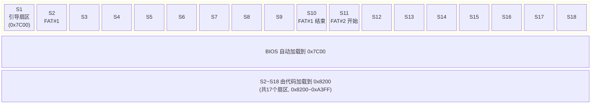
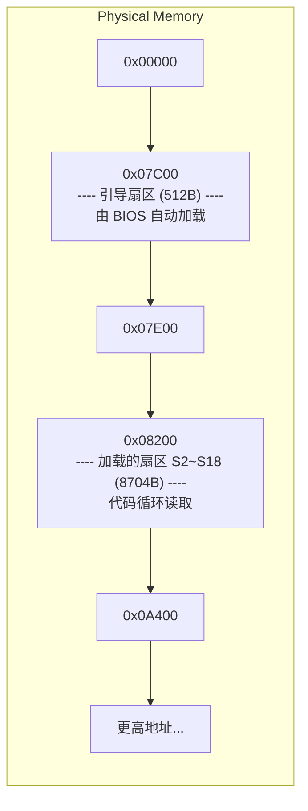

## 磁盘逻辑结构图 (FAT12, 1.44MB 软盘)

> **说明：**  
>
> - **S1 (扇区1)**：引导扇区，BIOS 自动载入物理地址 `0x7C00`。  
> - **S2 ~ S18 (扇区2~18)**：你的代码从柱面0、磁头0、扇区2开始，循环读取，直到扇区18，全部装入 `0x8200` 开始的内存。  
> - 按照标准的 FAT12 结构，S1~S18 包括：引导扇区、FAT1 (9个扇区)、FAT2 (9个扇区)，以及根目录区的起始部分（通常紧随 FAT2 之后）。你的加载范围正好覆盖了这些关键区域。

---

## 内存分布图

> **要点：**  
>
> - 两个区域之间有空隙 `0x7E00 ~ 0x8200`（正好 1KB 的间隔），这是有意设计的，避免堆栈和数据互相覆盖（堆栈在 `SS:SP = 0x0000:0x7C00`，向下增长，不会侵入数据区）。  
> - 读取的 17 个扇区包含了 FAT 表和根目录，后续可以在这些数据里解析文件。

这样图文结合，磁盘读取的逻辑就一目了然了。
