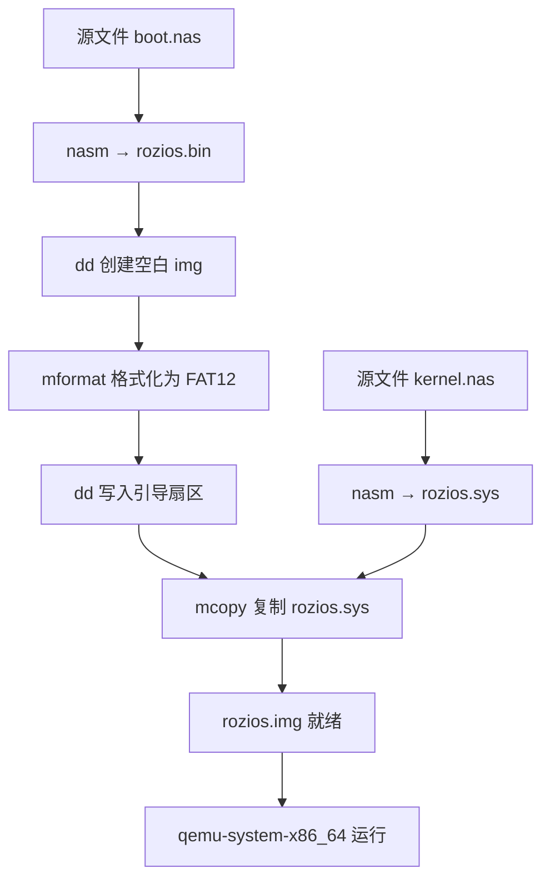
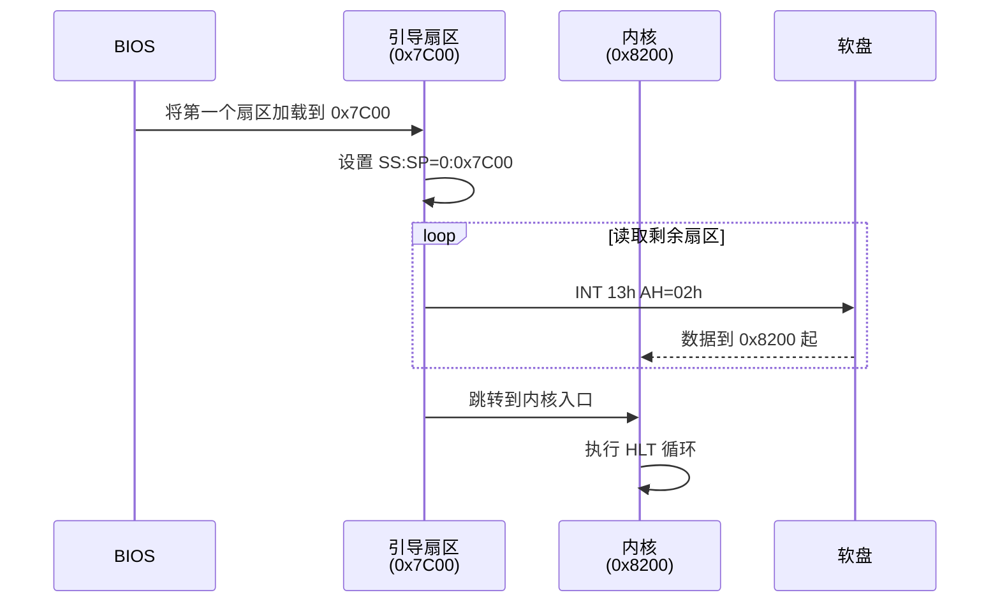

# Rozi OS 启动与构建知识归纳

本文档整理了从汇编源码到可运行磁盘镜像的完整知识链，涵盖 x86 实模式启动、FAT12 文件系统、NASM 汇编、磁盘镜像制作以及 `just` 构建工具的使用，适合复习与知识串联。

---

## 1. 实模式启动基础

### 1.1 内存布局（关键地址）

| 地址范围      | 用途                           |
| ------------- | ------------------------------ |
| `0x0000_0000` | BIOS 中断向量表等              |
| `0x0000_7C00` | 引导扇区（Boot Sector）加载位置 |
| `0x0000_7E00` | 引导扇区之后的内存（可自由使用）|
| `0x0000_8200` | 本项目中内核加载地址（ES=0x0820）|

### 1.2 段地址:偏移地址计算

物理地址 = 段地址 × 16 + 偏移地址（实模式）

示例：`ES = 0x0820`, `BX = 0` → 物理地址 = `0x8200`

### 1.3 BIOS 中断常用功能

| 中断号 | 功能          | 调用方式                       |
| ------ | ------------- | ------------------------------ |
| INT 10h| 屏幕输出      | AH=0x0E, AL=字符, BX=颜色/页码 |
| INT 13h| 磁盘服务      | AH=0x02 读扇区，AH=0x00 复位   |

---

## 2. FAT12 引导扇区结构（BPB）

引导扇区前 3 字节为跳转指令和 `nop`，紧接着是 BIOS Parameter Block（BPB）：

```nasm
JMP entry
DB    0x90
DB    "ROZI.IPL"        ; OEM 名称（8 字节）
DW    512               ; 每扇区字节数
DB    1                 ; 每簇扇区数
DW    1                 ; 保留扇区数（FAT 起始位置）
DB    2                 ; FAT 份数
DW    224               ; 根目录项数
DW    2880              ; 总扇区数（1.44MB）
DB    0xF0              ; 介质描述符
DW    9                 ; 每份 FAT 占用的扇区数
DW    18                ; 每磁道扇区数
DW    2                 ; 磁头数
DD    0                 ; 隐藏扇区数（不使用）
DD    2880              ; 总扇区数（再次）
DB    0,0,0x29          ; 扩展引导标志
DD    0xFFFFFFFF        ; 卷序列号
DB    "ROZI       "     ; 卷标（11 字节）
DB    "FAT12   "        ; 文件系统类型（8 字节）
```

**末尾签名**：引导扇区最后两个字节必须是 `0x55, 0xAA`，标记可启动磁盘。

---

## 3. NASM 汇编关键指令

| 指令/伪指令 | 作用                                 | 示例                      |
| ----------- | ------------------------------------ | ------------------------- |
| `ORG 0x7C00`| 指定代码段内偏移起点                 | `ORG 0x7C00`              |
| `EQU`       | 定义常量（类似 `#define`）           | `CYLS EQU 10`             |
| `DB`, `DW`, `DD` | 定义字节、字、双字数据         | `DB "ROZI"`, `DW 512`     |
| `times`     | 重复填充                             | `times 18 DB 0x00`        |
| `$`         | 当前行地址（相对于节开始）           | `times 0x1FE-($-$$) DB 0` |
| `$$`        | 当前节的起始地址（段基址）           |                           |
| `INT`       | 调用 BIOS / DOS 中断                 | `INT 0x13`                |
| `HLT`       | 暂停 CPU 直到下一个中断              | `HLT`                     |

---

## 4. 磁盘读取流程（INT 13h AH=02h）

读取磁盘扇区到内存的典型步骤：

```nasm
MOV  AH, 0x02          ; 读扇区功能号
MOV  AL, 1             ; 读取的扇区数
MOV  CH, 0             ; 柱面号（0‑1023）
MOV  CL, 2             ; 扇区号（1‑63）+ 柱面高位（仅硬盘）
MOV  DH, 0             ; 磁头号（0‑255）
MOV  DL, 0x00          ; 驱动器号（00h = 软驱 A）
MOV  BX, 0             ; 目标偏移地址
MOV  ES, BX            ; 目标段地址（ES:BX）
INT  0x13
JC   error             ; 若进位标志置位则出错
```

**错误处理模式**：重试 5 次，每次失败后先复位磁盘（AH=00h），失败超过 5 次则显示错误信息并停机。

**CHS 寻址**（本项目中）：

- 软盘：磁头 0‑1，每磁道 18 扇区，柱面 0‑CYLS‑1
- 读取循环：先增加扇区，到达 18 后换磁头，磁头换完再增加柱面。

---

## 5. 使用 `just` 构建项目

### 5.1 `just` 基础语法

| 概念         | 写法示例                                      |
| ------------ | --------------------------------------------- |
| 变量赋值     | `DEFAULT_BIN_NAME := "rozios.bin"`            |
| 带参数配方   | `make path out:`                              |
| 调用子配方   | `@just make {{bpath}} {{DEFAULT_BIN_NAME}}`   |
| 私有配方     | `[private]` 标记                              |
| 静默执行     | 行首加 `@`，不打印命令本身                    |
| 依赖关系     | `src_only: clean`（先执行 `clean`）           |
| 删除文件     | `-rm -f {{file}}`（忽略错误）                 |

### 5.2 本项目定义的配方

```bash
just img boot.nas kernel.nas       # 完整构建磁盘镜像
just dry boot.nas kernel.nas       # 构建并运行
just run                           # 仅运行已有镜像
just clean                         # 删除二进制和列表文件
just src_only                      # 彻底删除镜像
just --list                        # 列出所有配方及注释
```

### 5.3 工作流程



---

## 6. 磁盘镜像制作原理

| 命令                                                         | 作用                                         |
| ------------------------------------------------------------ | -------------------------------------------- |
| `dd if=/dev/zero of=rozios.img bs=512 count=2880`           | 创建 1.44MB 全零文件（2880 个 512 字节扇区） |
| `mformat -f 1440 -i rozios.img ::`                          | 格式化为 FAT12 文件系统                      |
| `dd if=rozios.bin of=rozios.img bs=512 count=1 conv=notrunc` | 写入前 512 字节（引导扇区），不截断文件      |
| `mcopy -i rozios.img rozios.sys ::`                         | 将系统文件复制到镜像根目录                   |

最终生成的 `rozios.img` 是一个标准的 1.44MB FAT12 软盘镜像，可直接被 QEMU 或真实硬件使用。

---

## 7. 当前项目文件结构（基于 `la` 输出）

```
.rozi
├── .direnv/                # direnv 环境
├── .envrc
├── .git/
├── .gitignore
├── days/
│   └── day03/
│       ├── rozi00e.nasm    # 引导扇区源码
│       └── rozi00e.sys.nasm# 内核源码
├── docs/
│   └── tips
├── justfile                # 构建配方
├── LICENSE
├── rozios.bin              # 编译后的引导扇区 (512B)
├── rozios.img              # 最终磁盘镜像 (1.5MB)
└── rozios.sys              # 编译后的内核 (3B)
```

---

## 8. 启动过程完整流程图（实际模式下）



---

## 9. 常见问题与调试技巧

| 现象                         | 可能原因                                                     |
| ---------------------------- | ------------------------------------------------------------ |
| QEMU 启动后黑屏或无输出      | 引导扇区签名 `0x55AA` 丢失；磁盘读取出错且未正确处理         |
| 显示 “load error”            | INT 13h 连续失败 5 次，请检查 CHS 参数或磁盘镜像格式是否正确 |
| `just img` 报错缺少参数      | 必须提供两个源文件路径：`just img boot.nas kernel.nas`       |
| `mcopy: command not found`   | 未安装 `mtools`，执行 `sudo apt install mtools`（Ubuntu）    |
| `nasm: fatal: unable to open`| 源文件路径错误或文件名大小写敏感                             |

---

## 10. 扩展知识点

- **实模式到保护模式**：现代操作系统在加载后会切换到 32 位/64 位保护模式，需要设置 GDT、A20 线等。
- **FAT12 根目录结构**：每个目录项 32 字节，包含文件名、扩展名、属性、首簇号、文件大小。本项目通过 `mcopy` 自动管理。
- **自定义 boot loader**：可以扩展引导扇区代码，支持加载 ELF 文件、解析文件系统、进入保护模式等。
- **`just` vs `make`**：`just` 语法更简洁，专为命令运行设计，适合开发流程；`make` 更适合复杂依赖构建。

---

> **复习建议**：对照 `rozi00e.nasm` 逐行理解引导扇区代码；手动执行 `just --dry-run img ...` 观察每个命令；修改内核代码（如添加字符输出）并重新构建，验证工作流程。
