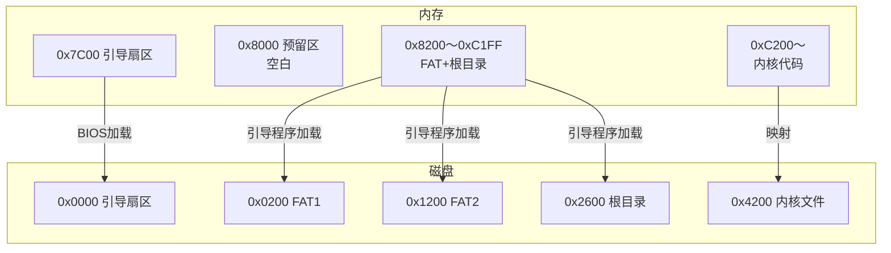
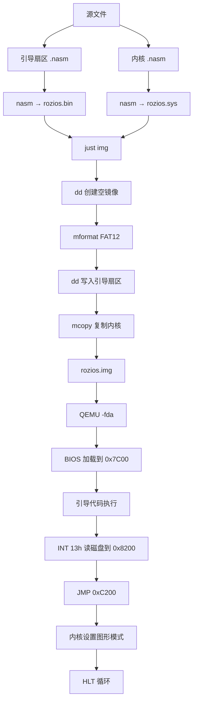

# RoziOS 开发知识归纳（Day03 总结）

本文档整合了从 `rozi00e` 到 `rozi00f` 的开发过程，涵盖 x86 实模式启动、FAT12 文件系统、磁盘读取、内存布局、图形模式切换及 QEMU 调试技巧。适合复习与知识串联。

---

## 一、实模式启动基础

### 1.1 BIOS 引导流程

```mermaid
flowchart LR
    A[开机] --> B[BIOS 自检]
    B --> C[读取磁盘第1扇区<br/>到 0x7C00]
    C --> D{最后两字节<br/>0x55AA?}
    D -- 是 --> E[跳转到 0x7C00<br/>执行引导代码]
    D -- 否 --> F[显示"Boot fail"]
```

### 1.2 关键内存地址

| 地址        | 用途                                       |
| ----------- | ------------------------------------------ |
| `0x00000`   | 中断向量表（IVT）                          |
| `0x00400`   | BIOS 数据区（BDA）                         |
| `0x07C00`   | 引导扇区加载地址（固定）                   |
| `0x08000`   | 预留启动区（可放引导扇区备份）             |
| `0x08200`   | 本项目磁盘数据加载基址（`ES=0x0820`）      |
| `0x0C200`   | 内核代码入口（`0x8200 + 0x4200`）          |
| `0xA0000`   | VGA 图形模式显存（320×200×8）              |

---

## 二、FAT12 软盘布局（1.44MB）

### 2.1 扇区分布

| 区域         | 扇区号（LBA） | 磁盘偏移（字节） | 大小    |
| ------------ | ------------- | ---------------- | ------- |
| 引导扇区     | 0             | 0x0000～0x01FF   | 1 扇区  |
| FAT 表 1     | 1～9          | 0x0200～0x11FF   | 9 扇区  |
| FAT 表 2     | 10～18        | 0x1200～0x21FF   | 9 扇区  |
| 根目录区     | 19～32        | 0x2600～0x41FF   | 14 扇区 |
| 数据区       | 33～2879      | 0x4200～...      | 2847 扇区|

### 2.2 重要常量（来自 BPB）

```nasm
CYLS   EQU 10      ; 柱面数（本项目）
BPB_BytsPerSec = 512
BPB_SecPerClus = 1
BPB_RsvdSecCnt = 1
BPB_NumFATs   = 2
BPB_RootEntCnt = 224
BPB_TotSec16  = 2880
BPB_FATSz16   = 9
BPB_SecPerTrk = 18
BPB_NumHeads  = 2
```

- **根目录区起始扇区** = `BPB_RsvdSecCnt + BPB_NumFATs * BPB_FATSz16` = 1 + 2×9 = **19**
- **数据区起始扇区** = 根目录区起始扇区 + 根目录区占用的扇区数 = 19 + (224*32)/512 = 19 + 14 = **33**

磁盘偏移 `0x4200` 对应扇区 33，即数据区起始，通常存放第一个文件的内容。

---

## 三、引导扇区核心代码解析（rozi00f.nasm）

### 3.1 初始化与磁盘读取

```nasm
ORG 0x7C00

entry:
  MOV   AX, 0
  MOV   SS, AX
  MOV   SP, 0x7C00        ; 堆栈指针，注意与代码区不重叠
  MOV   DS, AX

  MOV   AX, 0x820         ; ES = 0x0820 → 物理 0x8200
  MOV   ES, AX
  MOV   CH, 0             ; 柱面 0
  MOV   DH, 0             ; 磁头 0
  MOV   CL, 2             ; 从第 2 扇区开始读
```

### 3.2 读扇区循环（INT 13h AH=02h）

```nasm
readloop:
  MOV   SI, 0             ; 失败计数
retry:
  MOV   AH, 0x02
  MOV   AL, 1
  MOV   BX, 0
  MOV   DL, 0x00          ; A 盘
  INT   0x13
  JNC   next
  ... 错误重试（最多5次）
next:
  ADD   AX, 0x20          ; ES += 0x20 (512/16)
  MOV   ES, AX
  ADD   CL, 1
  CMP   CL, 18
  JBE   readloop          ; 下一扇区
  ; 换磁头、换柱面逻辑...
```

### 3.3 跳转到内核

```nasm
  MOV   [0x0FF0], CH      ; 保存柱面数（参数传递）
  JMP   0xC200            ; 跳转到内核入口
```

> 注意：`0xC200` 是物理地址，由 `0x8200`（加载基址）+ `0x4200`（磁盘偏移）得来。

---

## 四、内存加载映射关系图



### 关键公式

- **内核内存地址** = 加载基址（`0x8200`） + 磁盘偏移（`0x4200`） = **`0xC200`**
- 为什么不是 `0x7C00 + 0x4200 = 0xBE00`？  
  因为引导程序选择了独立的加载基址 `0x8200`，避开启动区保留区域。

---

## 五、内核代码与图形模式（rozi00f.sys.nasm）

### 5.1 代码

```nasm
ORG   0xC200

  MOV   AL, 0x13        ; VGA 320x200 256色
  MOV   AH, 0x00
  INT   0x10

fin:
  HLT
  JMP fin
```

### 5.2 图形模式说明

- `AL=0x13`：模式号，对应 320×200 像素，每个像素用 8 位索引色（共 256 色）。
- 显存起始地址：`0xA0000`，大小为 320×200 = 64000 字节。
- 调用后屏幕清为黑色，文本输出不再可用。

### 5.3 扩展：绘制像素

```nasm
  MOV   AX, 0xA000
  MOV   ES, AX
  XOR   DI, DI
  MOV   AL, 0x0F        ; 白色
  STOSB                 ; 画一个点
```

---

## 六、构建系统（justfile）要点

### 6.1 变量定义

```makefile
DEFAULT_BIN_NAME := rozios.bin
DEFAULT_SYS_NAME := rozios.sys
DEFAULT_IMG_NAME := rozios.img
```

### 6.2 关键配方

| 配方                      | 作用                                       |
| ------------------------- | ------------------------------------------ |
| `just make <src> <out>`   | 调用 NASM 编译单个文件                     |
| `just img boot sys`       | 编译引导扇区和内核，生成磁盘镜像           |
| `just dry boot sys`       | 构建并运行（开发用）                       |
| `just run`                | 启动 QEMU 软盘镜像（`if=floppy`）          |
| `just clean`              | 删除二进制文件                             |
| `just src_only`           | 彻底清理（包括镜像）                       |

### 6.3 镜像制作步骤

1. `dd` 创建空镜像（2880 个 512 字节扇区）
2. `mformat -f 1440` 格式化为 FAT12
3. `dd conv=notrunc` 写入引导扇区
4. `mcopy` 复制内核文件到镜像根目录

> 注意：QEMU 必须使用 `-fda` 或 `if=floppy` 启动软盘镜像，否则会当作硬盘引导失败。

---

## 七、QEMU 调试技巧

### 7.1 进入 monitor

在 QEMU 窗口中按 `Ctrl+Alt+2`，然后输入命令。

### 7.2 常用命令

| 命令                    | 作用                         |
| ----------------------- | ---------------------------- |
| `info registers`        | 查看 CPU 寄存器状态          |
| `x /10i 0xC200`         | 反汇编内存地址               |
| `xp /100b 0xC200`       | 查看原始内存字节             |
| `info tlb`              | 查看页表（保护模式）         |
| `system_reset`          | 重置虚拟机                   |

### 7.3 启动时附加参数（调试用）

```bash
qemu-system-x86_64 -fda rozios.img -d int -no-reboot -no-shutdown
```

- `-d int` 显示中断调用日志
- `-no-reboot` 遇到 triple fault 时不重启，便于分析

---

## 八、常见问题与解决

| 现象                                       | 可能原因及解决方案                         |
| ------------------------------------------ | ------------------------------------------ |
| QEMU 显示 `Booting from Hard Disk...` 卡住 | 镜像被当作硬盘，改用 `-fda` 或 `if=floppy` |
| `x /10i 0xC200` 显示全零                  | 磁盘读取失败或引导未执行，检查 `JMP 0xC200` 是否执行 |
| 屏幕全黑但寄存器正常                       | 图形模式未写入像素，属于正常；添加画点验证 |
| 引导扇区最后两个字节不是 `55 AA`           | 检查 `times 0x1fe-($-$$)` 计算是否正确     |
| `mcopy` 命令找不到                         | 安装 `mtools`：`sudo apt install mtools`   |

---

## 九、知识点串联图



---

## 十、下一步学习方向

- **文件解析**：在引导程序中解析 FAT12 根目录，根据文件名加载内核，而不是固定偏移。
- **保护模式**：从实模式切换到 32 位保护模式，使用更大的内存空间。
- **中断处理**：设置 IDT，实现键盘中断，编写简单的输入驱动。
- **显存操作**：在图形模式下绘制字符、画线、加载字体。

---

> 本总结对应 `days/day03/rozi00f.nasm` 与 `rozi00f.sys.nasm`，是操作系统开发中从“实模式引导”到“图形界面”的关键一步。建议反复动手实验，加深理解。
