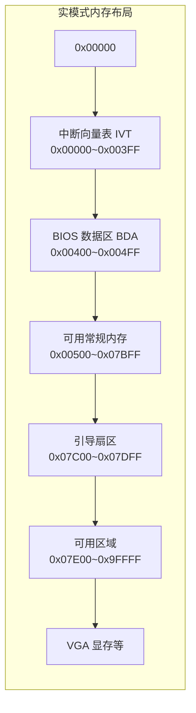
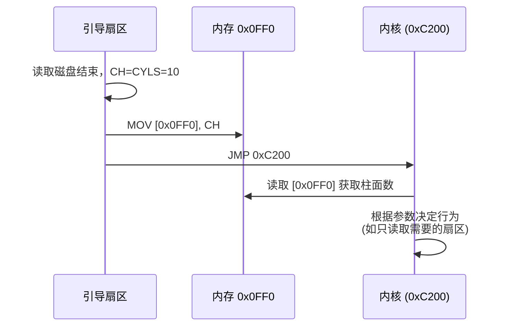

以下是对“引导程序向内存 `0x0FF0` 传递参数”这一设计的全面知识总结，适合复习与串联相关概念。

---

## 引导程序参数传递：为何选择内存地址 `0x0FF0`？

在 `rozi00f.nasm` 中，引导扇区执行完磁盘读取后，执行了：

```nasm
MOV [0x0FF0], CH   ; 将柱面数 CYLS=10 存入内存 0x0FF0
JMP 0xC200
```

内核代码随后可以从 `[0x0FF0]` 读取该值（尽管当前内核未使用）。这种设计体现了**引导程序与内核之间通过约定内存地址传递参数**的经典手法。

---

## 1. 实模式低端内存布局（1MB 以内）



| 地址范围          | 用途                                       | 是否可任意写入                     |
| ----------------- | ------------------------------------------ | ---------------------------------- |
| `0x00000~0x003FF` | 中断向量表（IVT）                           | **绝对不可**                       |
| `0x00400~0x004FF` | BIOS 数据区（BDA）                          | **不可**，否则系统不稳定           |
| `0x00500~0x07BFF` | 常规可用区域（约 30KB）                     | **可以安全使用**                   |
| `0x07C00~0x07DFF` | 引导扇区自身（512 字节）                    | 执行期间一般保留                   |
| `0x07E00~0x9FFFF` | 更大可用区域（约 608KB）                    | 可以，但需避免与堆栈或加载数据冲突 |
| `0xA0000~0xBFFFF` | VGA 显存（图形模式）                        | 写入会影响显示                     |
| `0xC0000~0xFFFFF` | 扩展 ROM、BIOS 等                           | 不可随意写入                       |

---

## 2. 为什么选 `0x0FF0`？

### 2.1 属于安全区域

- `0x0FF0 = 4080` 字节，落在 `0x00500~0x07BFF` 区间内，**远离中断向量表和 BIOS 数据区**。
- 该区域不会与 BIOS 临时缓冲区（如 `0x500~0x600`）冲突，且远离堆栈。

### 2.2 地址对齐与习惯

- `0x0FF0` 是一个**简单易记**的十六进制数，与 `0x7C00`、`0x8200`、`0xC200` 等形成风格统一。
- 按 16 字节对齐（`0xFF0 % 16 = 0`），但不是严格要求。

### 2.3 稳定性

- 引导程序设置的堆栈指针 `SP = 0x7C00`，向下增长。`0x0FF0` 远远低于 `0x7C00`，普通代码不会使堆栈增长到这么低，因此**不会被堆栈覆盖**。

---

## 3. 其他可选地址及原则

### 3.1 原则

1. **避开固定用途区域**：IVT、BDA、引导扇区自身、内核代码加载区。
2. **避开堆栈增长区域**（向下增长，地址低于当前 `SP` 且可能被 `PUSH` 覆盖）。
3. **避开 BIOS/DOS 保留区**（例如 `0x500~0x600` 常用于磁盘参数表）。
4. **持久性**：该地址在内核运行期间不应被其他数据覆盖。

### 3.2 常用替代地址

| 地址      | 安全性                                         |
| --------- | ---------------------------------------------- |
| `0x0E00`  | 安全，常用于传递参数                           |
| `0x1000`  | 非常安全，离堆栈更远                           |
| `0x7E00`  | 紧接引导扇区，但可能被引导程序自身作为缓冲区覆盖 |
| `0x0500`  | 传统 DOS 起始地址，但部分 BIOS 中断会使用       |

> **结论**：只要遵守上述原则，任何一个“空闲且不被覆盖”的地址都可以作为参数传递区。`0x0FF0` 是经验选择，不是唯一选择。

---

## 4. 为什么不直接用寄存器？

- **寄存器易变**：内核代码在执行过程中会修改几乎所有寄存器，如果仅通过 `CH` 传递，内核入口第一时间就要保存它，增加了复杂度。
- **内存更稳定**：存入内存后，内核可以在任意时刻读取，不受寄存器重用影响。
- **扩展性好**：可以连续存放多个参数（如扇区数、内存大小、磁盘参数表指针等）。

---

## 5. 完整的数据流图



---

## 6. 扩展知识点：参数传递的常见方式

| 方式                     | 示例                     | 优缺点                                       |
| ------------------------ | ------------------------ | -------------------------------------------- |
| **固定内存地址**         | `MOV [0x0FF0], CH`       | 简单、稳定，多参数可连续存放                 |
| **约定寄存器**           | `MOV AX, CYLS`           | 速度快，但寄存器数量有限，易被覆盖           |
| **栈传递**               | `PUSH CYLS; JMP kernel`  | 高级语言风格，但需要内核正确管理栈           |
| **磁盘特定扇区**         | 将参数写入隐藏扇区       | 不影响常规内存，但需要额外的磁盘 I/O         |
| **内核嵌入默认值**       | 在内核中硬编码 `CYLS=10` | 最简单，但无法动态调整                       |

在当前阶段，固定内存地址是最适合教学和实验的方式。

---

## 7. 实验验证

你可以修改 `rozi00f.sys.nasm` 来验证参数是否成功传递：

```nasm
ORG 0xC200

  ; 读取引导程序保存的参数
  MOV  AL, [0x0FF0]      ; AL = 10
  ADD  AL, '0'           ; 转换为 ASCII
  MOV  AH, 0x0E          ; 文本输出（但图形模式下不可见）
  INT  0x10              ; 实际上不会显示，因为已进入图形模式

  MOV  AL, 0x13
  MOV  AH, 0x00
  INT  0x10
  ...
```

更好的验证方式：在切换图形模式之前输出，并暂时保留文本模式。可以先将内核代码改为先输出再切换，就能看到数字 `10`。

---

## 8. 总结

- **`0x0FF0` 是一个安全、稳定的内存地址**，位于常规可用区，不与其他关键数据冲突。
- 引导程序通过该地址将**磁盘装载的柱面数**传递给内核，体现了**跨阶段参数传递**的思想。
- 其他空闲地址也可使用，但需遵循不覆盖 IVT、BDA、堆栈、自身代码等基本原则。
- 这种方式比寄存器传递更可靠，且易于扩展。

---

> 本知识点是操作系统引导流程中“从实模式引导到内核执行”的关键细节。理解内存布局和参数传递机制，为后续开发更复杂的 bootloader 和多阶段加载器打下坚实基础。
