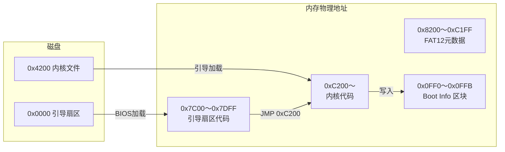

# RoziOS 开发知识归纳（Day03 rozi00g）

本文档总结 `rozi00g` 版本中新增的**引导程序与内核之间的结构化参数传递**设计，涵盖内存布局的约定、键盘 LED 状态获取、图形模式信息记录等知识点。适合复习与串联。

---

## 一、版本演进对比

| 版本       | 内核特点                                       | 参数传递方式                     |
| ---------- | ---------------------------------------------- | -------------------------------- |
| `rozi00e`  | 单纯 `HLT` 循环                                | 无                               |
| `rozi00f`  | 切换到 VGA 图形模式（`INT 0x10, AX=0x0013`）   | 引导程序保存 `CH` 到 `0x0FF0`    |
| **`rozi00g`** | 图形模式 + **记录屏幕信息 + 键盘 LED 状态** | **定义多个参数地址，内核主动填充** |

`rozi00g` 的核心改进是：**内核主动向约定内存地址写入系统信息**，这些信息可供后续程序（如更高层的 C 语言部分）读取。

---

## 二、新增的 Boot Info 区域（内存地址约定）

在 `rozi00g.sys.nasm` 开头定义了如下常量（地址）：

```nasm
CYLS    EQU   0x0FF0    ; 柱面数（引导程序已写入）
LEDS    EQU   0x0FF1    ; 键盘 LED 指示灯状态
VMODE   EQU   0x0FF2    ; 颜色位数（8 表示 256 色）
SCRNX   EQU   0x0FF4    ; 屏幕宽度（WORD）
SCRNY   EQU   0x0FF6    ; 屏幕高度（WORD）
VRAM    EQU   0x0FF8    ; 显存起始地址（DWORD）
```

这些地址位于 **0x0FF0 ~ 0x0FFB** 之间，属于实模式下的**常规可用内存区域**（`0x00500~0x07BFF`），不会与 BIOS 或堆栈冲突。

---

## 三、内核初始化流程（rozi00g.sys.nasm）

```nasm
ORG 0xC200

  ; 1. 设置图形模式
  MOV   AL, 0x13
  MOV   AH, 0x00
  INT   0x10

  ; 2. 记录屏幕参数
  MOV   WORD [SCRNX], 320     ; 宽度
  MOV   WORD [SCRNY], 200     ; 高度
  MOV   BYTE [VMODE], 8       ; 颜色位数（256色）
  MOV   DWORD [VRAM], 0xA0000 ; 显存物理地址

  ; 3. 获取键盘 LED 状态
  MOV   AH, 0x02
  INT   0x16                  ; 键盘 BIOS 服务
  MOV   [LEDS], AL            ; AL 的低 3 位表示 NumLock/CapsLock/ScrollLock

fin:
  HLT
  JMP fin
```

### 3.1 图形模式参数详解

| 参数名   | 值          | 说明                                   |
| -------- | ----------- | -------------------------------------- |
| `SCRNX`  | 320         | 水平分辨率（像素）                     |
| `SCRNY`  | 200         | 垂直分辨率                             |
| `VMODE`  | 8           | 颜色深度（8 位索引色，共 256 色）      |
| `VRAM`   | `0xA0000`   | VGA 图形模式显存起始地址（64000 字节） |

这些信息可供后续的图形绘制函数直接使用，而不需要再次查询 BIOS。

### 3.2 键盘 LED 状态（INT 16h AH=02h）

- **调用方式**：`MOV AH, 0x02; INT 0x16`
- **返回值**：`AL` 的低 3 位含义：
  - Bit 0: Scroll Lock 状态（1 = 开启）
  - Bit 1: Num Lock 状态
  - Bit 2: Caps Lock 状态
- **存储**：写入 `LEDS`（地址 `0x0FF1`），可让上层系统知道初始键盘指示灯状态。

---

## 四、引导程序的配合（rozi00g.nasm）

引导程序与 `rozi00f` 完全相同，仍然执行：

```nasm
  MOV [0x0FF0], CH   ; 将柱面数 CYLS 写入 0x0FF0
  JMP 0xC200
```

这表示 **`CYLS` 地址由引导程序写入**，而其他地址（`LEDS`, `VMODE`, `SCRNX`, `SCRNY`, `VRAM`）由内核填充。两者共同构成完整的系统信息块。

---

## 五、内存布局更新图（含 Boot Info 区域）



**Boot Info 区块详细偏移**：

| 地址   | 大小 | 内容           | 写入者         |
| ------ | ---- | -------------- | -------------- |
| 0x0FF0 | 1    | `CYLS` 柱面数  | 引导程序       |
| 0x0FF1 | 1    | `LEDS` 键盘LED | 内核（INT 16h）|
| 0x0FF2 | 1    | `VMODE` 颜色位 | 内核（固定8）  |
| 0x0FF4 | 2    | `SCRNX` 宽度   | 内核（320）    |
| 0x0FF6 | 2    | `SCRNY` 高度   | 内核（200）    |
| 0x0FF8 | 4    | `VRAM` 显存地址| 内核（0xA0000）|

> 注意：`SCRNX` 和 `SCRNY` 使用 WORD（2 字节），`VRAM` 使用 DWORD（4 字节），因此地址不连续但预留了足够空间。

---

## 六、为什么需要显式记录显存地址和分辨率？

1. **避免重复 BIOS 调用**：图形模式下无法使用 `INT 0x10` 的文本输出，且查询模式号也需要额外代码。提前记录可让绘图函数直接使用。
2. **跨模块一致性**：后续如果用 C 语言编写图形库，这些固定地址可作为全局变量引用。
3. **键盘 LED 状态**：某些程序需要知道初始 Caps Lock 等状态，避免启动时状态不一致。

---

## 七、实验验证

运行以下命令构建并启动 `rozi00g`：

```bash
just dry days/day03/rozi00g.nasm days/day03/rozi00g.sys.nasm
```

进入 QEMU monitor（`Ctrl+Alt+2`），检查 Boot Info 区域：

```
xp /8b 0x0FF0
```

预期输出类似：

```
00000ff0: 0a 00 08 40 01 c8 00 00
```

解读：

- `0x0FF0`: 0x0a = 10 (CYLS)
- `0x0FF1`: 0x00 (键盘 LED 全灭)
- `0x0FF2`: 0x08 (8 位色)
- `0x0FF4`: 0x0140 (320 小端)
- `0x0FF6`: 0x00C8 (200 小端)
- `0x0FF8`: 0x000A0000 (DWORD 小端: 00 00 0A 00)

---

## 八、扩展知识点：从 bootloader 到操作系统内核的信息传递

| 方式             | 优点                     | 缺点                         | 本项目实例             |
| ---------------- | ------------------------ | ---------------------------- | ---------------------- |
| 固定内存地址     | 简单、高效               | 需避免冲突                   | `0x0FF0` 等地址约定    |
| BIOS 数据区 (BDA) | 标准、可靠               | 空间有限（仅 256 字节）      | 未使用                 |
| 栈传递           | 灵活                     | 需要内核正确设置栈           | 未使用                 |
| 引导扇区后保留区 | 与代码分离               | 可能被后续加载覆盖           | 未使用                 |

`rozi00g` 采用的固定内存地址方案非常适合小型教学操作系统。

---

## 九、完整知识点串联图

```mermaid
flowchart TD
    subgraph 构建过程
        A[rozi00g.nasm] --> B[nasm → rozios.bin]
        C[rozi00g.sys.nasm] --> D[nasm → rozios.sys]
        B & D --> E[just 创建 FAT12 镜像]
    end

    subgraph 启动过程
        E --> F[QEMU -fda]
        F --> G[BIOS 加载 rozios.bin 到 0x7C00]
        G --> H[引导代码: 读磁盘到 0x8200]
        H --> I[引导代码: MOV [0x0FF0], CH]
        I --> J[引导代码: JMP 0xC200]
        J --> K[内核: 设置图形模式]
        K --> L[内核: 写入 SCRNX/SCRNY/VMODE/VRAM]
        L --> M[内核: INT 16h 获取键盘LED → [LEDS]]
        M --> N[HLT 循环]
    end

    subgraph 信息可供后续使用
        P[0x0FF0~0x0FFB] --> Q[C语言图形库<br/>键盘驱动等]
    end
```

---

## 十、总结

- **`rozi00g` 定义了标准化的 Boot Info 区块**，地址范围 `0x0FF0 ~ 0x0FFB`。
- **内核负责填充屏幕参数和键盘状态**，引导程序仅提供柱面数。
- **这种方法为后续开发图形界面和输入处理奠定了基础**，避免了硬编码数字。
- **使用 QEMU monitor 的 `xp` 命令可以直观验证内存写入是否成功**。

下一步可以基于这些信息，用 C 语言编写简单的 `putpixel` 函数，并进一步实现字符输出和键盘响应。
